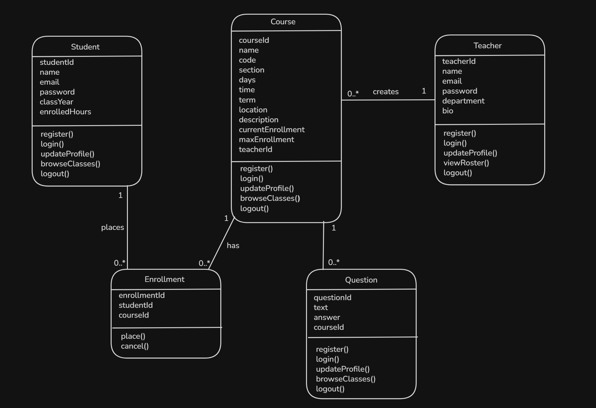

# Schedule Sidekick Backend API

**Last Updated:** July 10, 2025

**Base URL:**

- local: http://localhost:8080
- production: https://su26-team7.onrender.com

## Table Contents

1. [Overview](#1-overview)
2. [UML Class Diagram](#2-uml-class-diagram)
3. [API Endpoints](#3-api-endpoints)
    - [Student Endpoints](#31-student-endpoints)
    - [Course Endpoints](#32-course-endpoints)
    - [Enrollment Endpoints](#33-enrollment-endpoints)
    - [Teacher Endpoints](#32-course-endpoints)
    - [Question Endpoints](#33-enrollment-endpoints)

---

## 1.

The ScheduleSidekick backend exposes a RESTful API for the Class Scheduling platform described in the SRS. It supports user registration and profile management, course browsing, course management, a view of enrollments, course lookup by department, and the ability for students to veiw their enrollments.

---

## 2. UML Class Diagram



---

## 3. API Endpoints

### 3.1 Student Endpoints

#### Create a Student

```http
POST /api/students
```

Request body:

```json
{
    "name": "Example_Name",
    "email": "example_email@gmail.com",
    "password": "ExPass1",
    "classYear": 1,
    "enrolledHours": 12
}
```

Example response:

```json
{
    "id": 1,
    "name": "Example_Name",
    "email": "example_email@gmail.com",
    "password": "ExPass1",
    "classYear": 1,
    "enrolledHours": 12,
    "enrollment": []
}
```

#### Get all students

```http
GET /api/students
```

#### Get a student by id

```http
Get /api/students/{id}
```

#### Update student personal information

```http
PUT /api/students/{id}/editpersonalinfo
```

Example request body:

```json
{
    "name": "newExName",
    "email": "Example_Email@gmail.com",
    "password": "moreEncryptedPassword78"
}
```

#### Admin update student(stretch)

```http
PUT /api/students/{id}
```

Example request body:

```json
{
    "name": "NewExample_Name",
    "email": "Newexample_email@gmail.com",
    "password": "NewExPass1",
    "classYear": 2,
    "enrolledHours": 15
}
```

#### Delete a student

```http
DELETE /api/students/{id}
```

---

### 3.2 Course Endpoints

#### Create a course

```http
POST /api/course
```

Request body:

```json
{
    "name": "Principals of Computer Architecture",
    "code": "CSC 461",
    "section": "001",
    "days": "TR",
    "startTime": "12:30:00",
    "endTime": "13:45:00",
    "term": "Fall 2026",
    "location": "Petty 224",
    "description": "Hardware and software components of computer systems, their organization and operations.",
    "maxEnrollment": 30,
    "currentEnrollment": 0,
    "teacher": { "id": 3 }
}
```

#### Get all Courses

```http
GET /api/course
```

#### Get a course by code(department)

```http
GET /api/course/search?query={code}
```

Example response:

```json
[
    {
        "code": "CSC 340",
        "currentEnrollment": 0,
        "days": "MWF",
        "description": "Introduces software engineering principles including requirements, design, testing, version control,  and team-based development.",
        "endTime": "09:50:00",
        "id": 1,
        "location": "Petty 225",
        "maxEnrollment": 30,
        "name": "Software Engineering",
        "section": "001",
        "startTime": "09:00:00",
        "teacher": {
            "bio": "Professor of Computer Science specializing in software engineering, machine learning, and data    structures.",
            "department": "Computer Science",
            "email": "dupadhyay@uncg.edu",
            "id": 1,
            "name": "Dr. Parth Upadhyay",
            "password": "$2a$10$ExampleHashedPassword123456789"
        },
        "term": "Fall 2026"
    },
    {
        "code": "CSC 330",
        "currentEnrollment": 0,
        "days": "TR",
        "description": "Covers algorithm analysis, recursion, linked lists, stacks, queues, trees, hash tables, heaps, and graph algorithms.",
        "endTime": "15:15:00",
        "id": 2,
        "location": "Bryan 160",
        "maxEnrollment": 28,
        "name": "Data Structures and Algorithms",
        "section": "002",
        "startTime": "14:00:00",
        "teacher": {
            "bio": "Professor whose teaching interests include Software Engineering, Web Development, and Advanced Data Structures.",
            "department": "Computer Science",
            "email": "sntini@uncg.edu",
            "id": 2,
            "name": "Ms. Sunny Ntini",
            "password": "$2a$10$ExampleHashedPassword987654321"
        },
        "term": "Fall 2026"
    }
]
```

#### Update course information

```http
PUT api/course/{id}
```

Example request body

```json
{
    "name": "Principals of Computer Architecture",
    "code": "CSC 461",
    "section": "002",
    "days": "TR",
    "startTime": "14:00:00",
    "endTime": "15:15:00",
    "term": "Fall 2026",
    "location": "Petty 224",
    "description": "Hardware and software components of computer systems, their organization and operations.",
    "maxEnrollment": 30,
    "currentEnrollment": 0,
    "teacher": { "id": 3 }
}
```

#### Delete a course

```http
DELETE /api/course/{id}
```

---

### 3.3 Enrollment Endpoints

#### Create an Enrollment

```http
POST /api/enrollments
```

Request body

```json
{
    "student":{
        "id:5"
    },
    "course"{
        "id:3"
    }
}
```

#### Get enrollment by ID

```http
GET /api/enrollments/{enrollmentId}
```

#### Get enrollments by courseId(roster)

```http
GET /api/enrollments/roster/{courseId}
```

#### Get enrollments by StudentId

```http
GET /api/enrollments/student/{studentId}
```

#### Delete enrollment

```http
DELETE /api/enrollments/{enrollmentId}
```

---

### 3.4 Teacher Endpoints

#### Create a teacher

```http
POST /api/teacher
```

Request body:

```json
{
    "bio": "Professor of Computer Science specializing in software engineering, machine learning, and data structures.",
    "department": "Computer Science",
    "email": "dupadhyay@uncg.edu",
    "name": "Dr. Parth Upadhyay",
    "password": "examplepassword"
}
```

Example response:

```json
{
    "bio": "Professor of Computer Science specializing in software engineering, machine learning, and data structures.",
    "courses": [],
    "department": "Computer Science",
    "email": "dupadhyay@uncg.edu",
    "id": 1,
    "name": "Dr. Parth Upadhyay",
    "password": "$2a$10$examplepassword"
}
```

#### Get a teacher by id

```http
GET /api/teacher/{id}
```

#### Update teacher information

```http
PUT /api/teacher/{id}
```

Example request body:

```json
{
    "bio": "Professor of Computer Science specializing in machine learning.",
    "department": "Computer Science",
    "email": "dupadhyay@uncg.edu",
    "name": "Dr. Parth Upadhyay"
}
```

#### Delete a teacher

```http
DELETE /api/teacher/{id}
```

---

### 3.5 Question Endpoints

#### Create a question

```http
POST /api/question
```

Request body:

```json
{
    "text": "How much writing is required in this class?"
}
```

Example response:

```json
{
    "answer": null,
    "course": {
        "code": "CSC 340",
        "currentEnrollment": 0,
        "days": "MWF",
        "description": "Introduces software engineering principles including requirements, design, testing, version control, and team-based development.",
        "endTime": "09:50:00",
        "id": 1,
        "location": "Petty 225",
        "maxEnrollment": 30,
        "name": "Software Engineering",
        "section": "001",
        "startTime": "09:00:00",
        "teacher": {
            "bio": "Professor of Computer Science specializing in software engineering, machine learning, and data structures.",
            "department": "Computer Science",
            "email": "dupadhyay@uncg.edu",
            "id": 1,
            "name": "Dr. Parth Upadhyay",
            "password": "examplepassword"
        },
        "term": "Fall 2026"
    },
    "id": 1,
    "text": "How much writing is required in this class?"
}
```

#### Get a question by id

```http
GET /api/question/{id}
```

#### Update question information

```http
PUT /api/question/{id}
```

Example request body:

```json
{
    "answer": "20 pages over the semester",
    "text": "How much writing is required in this class?"
}
```

#### Delete a question

```http
DELETE /api/question/{id}
```

---
